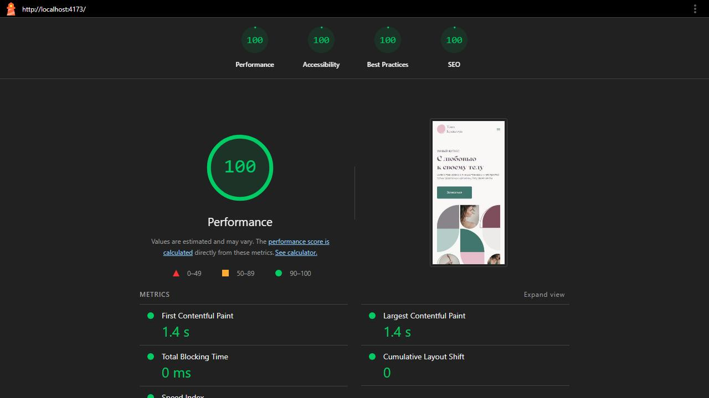
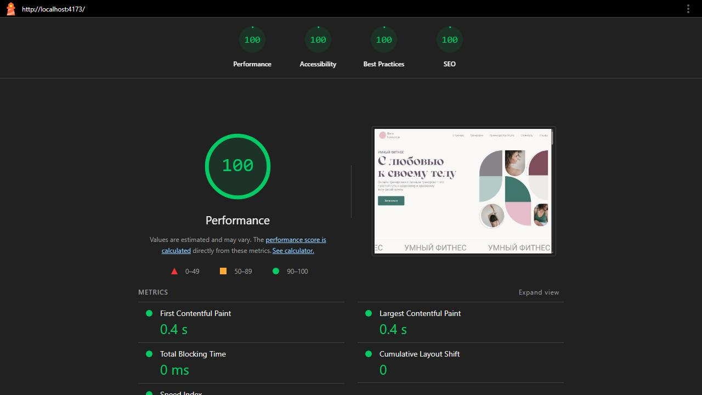
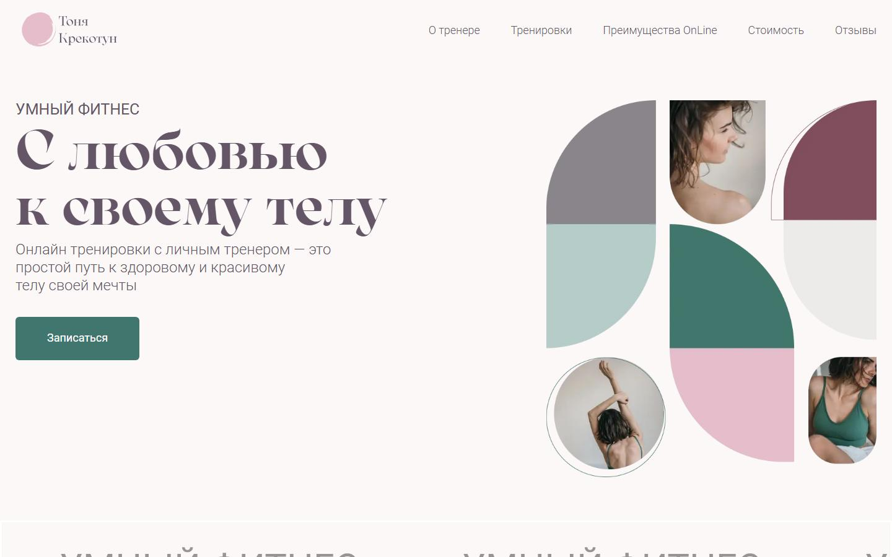
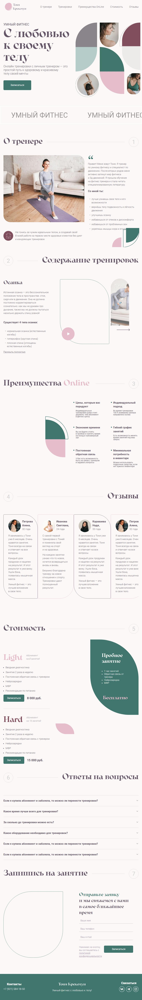
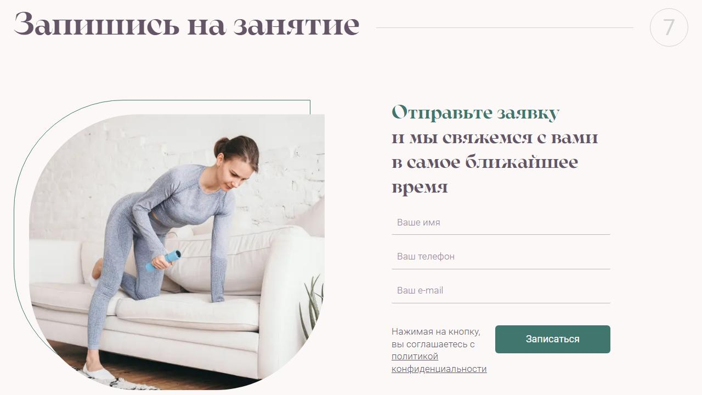

# Fitness Coach Landing Page

Адаптивный лендинг для персонального тренера с упором на чистую вёрстку, производительность и кроссбраузерность.

👉 Демо: https://antonina-krekotun.netlify.app  
👉 Код: https://github.com/SemenKr/AntoninaKrekotunCoach  

---

## Ключевые особенности

- Адаптивная вёрстка (mobile-first)  
- Кроссбраузерная совместимость  
- Семантическая HTML-разметка  
- Использование методологии БЭМ  
- Оптимизация изображений и SVG  
- Pixel-perfect вёрстка по макету  
- Линтеры и форматтер для стабильного качества кода  

---

## Что реализовано

- Построение адаптивного интерфейса под разные устройства  
- Организация CSS-архитектуры с использованием БЭМ  
- Оптимизация загрузки и отображения ресурсов  
- Работа с SVG-спрайтами  
- Обеспечение корректного отображения в разных браузерах  

---

## Цели проекта

- Чистая и поддерживаемая вёрстка по макету  
- Набор практик, который удобно защищать на собеседовании  
- Понятная структура проекта и предсказуемый build  

---

## Что улучшено для портфолио

- Исправлена работа слайдеров и добавлен отложенный импорт Swiper  
- Уточнены якоря и доступность навигации и интерактивов  
- Ускорена загрузка: код слайдера вынесен в отдельные чанки  
- Добавлены линтеры, форматтер и CI-проверки  

---

## Стек

HTML · CSS · SCSS · БЭМ  

---

## Структура проекта

- `src/` — исходники (HTML, SCSS, JS, изображения)  
- `config/` — настройки Gulp и Webpack  
- `docs/` — скриншоты и Lighthouse-отчёты  

---

## Скриншоты

<table>
  <tr>
    <td></td>
    <td></td>
  </tr>
</table>

<table>
  <tr>
    <td></td>
    <td></td>
  </tr>
  <tr>
    <td></td>
    <td></td>
  </tr>
</table>

---

## Lighthouse

Замер: 2026-03-31, локальная сборка `npm run build`. Условия: Lighthouse CLI, `--throttling-method=provided`.

| Профиль | Performance | Accessibility | Best Practices | SEO |
| --- | --- | --- | --- | --- |
| Mobile | 100 | 100 | 100 | 100 |
| Desktop | 100 | 100 | 100 | 100 |

Отчеты: [before](docs/lighthouse/before-mobile.report.html), [after mobile](docs/lighthouse/after-mobile.report.html), [after desktop](docs/lighthouse/after-desktop.report.html)

---

## Размер бандлов (production)

| Артефакт | До | После |
| --- | --- | --- |
| CSS `style.css` | 140 KiB | 123 KiB |
| JS `app.min.js` (entry) | 102 KiB | 22.1 KiB |

Примечание: Swiper вынесен в асинхронные чанки (`97.app.min.js`, `652.app.min.js`) и загружается при инициализации слайдеров.

---

## Запуск

```bash
npm install
npm run dev
```

## Сборка

```bash
npm run build
```

## Проверки качества

```bash
npm run lint
```

```bash
npm run format
```

```bash
npm run test
```
